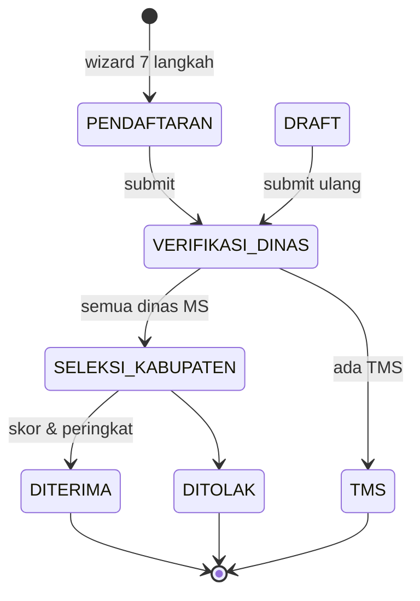

# Workflow Sistem Kartu Hebat Mahasiswa

Sistem beasiswa Kabupaten Murung Raya. Mahasiswa mendaftar, lalu pengajuan diverifikasi lintas dinas (paralel) → seleksi kabupaten hingga hasil dipublikasikan.

## Ringkasan Alur



Diagram teks (ASCII):

```
PENDAFTARAN (wizard 7 langkah)
        │  submit
        ▼
VERIFIKASI_DINAS  (3 dinas paralel: Dukcapil, Sosial, Pendidikan;
                   4 dinas utk jalur Disabilitas: + Dinkes;
                   4 dinas utk jalur Prestasi: + Parsepor)
      │
      ├── ada TMS ─────► TMS
      │
      └── semua MS ────► SELEKSI_KABUPATEN
                              │
                              ├── DITERIMA
                              └── DITOLAK
                                    │
                              PUBLIKASI HASIL
```

## Aktor (Role)

| Role | Tahap | Keputusan |
|---|---|---|
| `mahasiswa` | Pendaftaran | Mengisi wizard & submit |
| `operator_dukcapil` | Lintas Dinas | MS / TMS (paralel) |
| `operator_sosial` | Lintas Dinas | MS / TMS + desil sosial |
| `operator_pendidikan` | Lintas Dinas | MS / TMS + desil pendidikan |
| `operator_dinkes` | Lintas Dinas (jalur Disabilitas saja) | MS / TMS |
| `operator_parsepor` | Lintas Dinas (jalur Prestasi saja) | MS / TMS |
| `operator_kabupaten` | Seleksi Kabupaten | Skoring, peringkat, DITERIMA/DITOLAK, publikasi |
| `superadmin` | Konfigurasi | Kategori, jenis dokumen, operator |

> **Catatan**: role `operator_desa` dan `operator_kecamatan` masih tersedia di sistem untuk kebutuhan laporan/riwayat, tetapi tidak lagi berperan dalam alur verifikasi. Tahap verifikasi desa & kecamatan sudah dihapus.

## 1. Pendaftaran

Mahasiswa mengisi **wizard 7 langkah**, tersimpan di tabel `pendaftarans`:

1. Data Pribadi
2. Pendidikan
3. Prestasi
4. Orang Tua
5. Dokumen
6. Review
7. Submit

Saat submit, `PendaftaranWorkflowBridgeService` menjembatani pendaftaran ke workflow verifikasi:

1. **Resolve wilayah** — memetakan desa/kelurahan ke master `villages` (dengan normalisasi nama wilayah).
2. **Resolve jalur** — menentukan `ApplicationType` dari kategori beasiswa: `AKADEMIK`, `TIDAK_MAMPU`, `DISABILITAS`, `NON_AKADEMIK`.
3. **Sinkronisasi** — menyalin data ke `MahasiswaProfile`, membuat/memperbarui `Application`, dan menyalin `Document`.
4. Memanggil `ApplicationWorkflowService::submit()`.

### Validasi sebelum submit

`ApplicationWorkflowService::submit()` menolak jika:

- Bukan milik mahasiswa / periode tidak aktif / status tidak bisa diedit.
- Jalur (`application_type`) belum dipilih.
- Profil belum lengkap.
- IPK kosong untuk jalur `AKADEMIK` / `NON_AKADEMIK`.
- Jalur `NON_AKADEMIK` tanpa minimal satu prestasi.
- Dokumen wajib belum lengkap (dicocokkan per jalur).

## 2. Keputusan Verifikasi (MS / TMS)

Setiap operator dinas memberi **satu keputusan keseluruhan** (MS/TMS) atas aplikasi, **ditambah checklist per-berkas** (lihat ADR-0003): tiap dokumen dinilai `memenuhi` / `tidak_memenuhi` / `belum_dinilai` per tahap, tersimpan di `document_verifications`. Checklist adalah alat bantu + jejak audit; keputusan akhir tetap manual.

| Keputusan | Arti | Efek |
|---|---|---|
| **MS** (Memenuhi Syarat) | Lanjut (jika semua dinas MS) | Status naik |
| **TMS** (Tidak Memenuhi Syarat) | Final, ditolak | Status jadi `TMS` |

## 3. Verifikasi Lintas Dinas (paralel)

Inti logika ada di `ApplicationWorkflowService::verify()`, yang memilih handler berdasarkan role operator (`storeVerificationAndResolveTarget`).

- Prasyarat status: `VERIFIKASI_DINAS`.
- Dinas Dukcapil, Sosial, Pendidikan memverifikasi **paralel** untuk semua jalur; Dinas Kesehatan (**Dinkes**) hanya untuk jalur **DISABILITAS**, Dinas **Parsepor** hanya untuk jalur **NON_AKADEMIK** (Prestasi). Masing-masing menyimpan di `agency_verifications` (key: `application_id` + `agency`).
- Jumlah dinas yang wajib memutuskan ditentukan per-jalur oleh `DocumentVerificationService::requiredAgencies()`: 3 untuk AKADEMIK/TIDAK_MAMPU, 4 (termasuk Dinkes) untuk DISABILITAS, 4 (termasuk Parsepor) untuk NON_AKADEMIK.
- **Status application belum berubah** sampai semua dinas yang wajib selesai (`return null` selama belum lengkap).
- Saat lengkap:
  - Ada TMS → `TMS`.
  - Semua MS → hitung skor (`SelectionScoringService::calculate`) → `SELEKSI_KABUPATEN`.
- Dinas juga menulis efek ke profil:
  - Dukcapil → `status_kependudukan` (`sesuai` / `tidak_sesuai`).
  - Sosial → `desil_sosial`.
  - Pendidikan → `desil_pendidikan`.
  - Dinkes → tidak menulis efek skoring; hanya MS/TMS.
  - Parsepor → tidak menulis efek skoring; hanya MS/TMS.

## 4. Alur Perbaikan (draft)

Tidak ada keputusan BTL. Aplikasi yang perlu diperbaiki dikembalikan ke status `DRAFT` (secara administratif), mahasiswa memperbaiki data/dokumen lalu submit ulang — langsung masuk antrean `VERIFIKASI_DINAS` lagi.

Saat mahasiswa submit ulang, `ApplicationWorkflowService::submit()` menyetel status ke `VERIFIKASI_DINAS`. Penilaian dokumen lama dibersihkan agar dinas menilai ulang dari awal (putaran baru).

## 5. Seleksi & Skoring

`SelectionScoringService` menghitung skor per jalur memakai Strategy pattern di `app/Services/Scoring/`:

| Jalur | Strategy | Basis |
|---|---|---|
| AKADEMIK | `AcademicScoring` | IPK & semester |
| TIDAK_MAMPU | `DesilScoring` | Desil sosial ekonomi |
| DISABILITAS | `DisabilityScoring` | IPK, semester, jenis disabilitas |
| NON_AKADEMIK | `PrestasiScoring` | Tingkat & peringkat kejuaraan |

- Skor dihitung: `normalized × weight` per kriteria → `final_score` di `selections`.
- `recalculateRanking()` mengurutkan per kabupaten & jalur, mengisi `rank`.
- Operator kabupaten memutuskan `DITERIMA` / `DITOLAK`, lalu memublikasikan ke halaman `public.results`.

## 6. Pencatatan & Notifikasi

- Setiap transisi dicatat di `verification_logs` (from/to status, action, actor, notes, metadata).
- Notifikasi (`ApplicationStatusChanged`) dikirim ke mahasiswa dan operator tahap berikutnya (berdasarkan role + wilayah).

## Status Lengkap (`ApplicationStatus`)

| Status | Keterangan |
|---|---|
| `DRAFT` | Belum dikirim / dikembalikan untuk diperbaiki |
| `VERIFIKASI_DINAS` | Antrean verifikasi lintas dinas (3 dinas paralel; 4 utk Disabilitas/Prestasi) |
| `SELEKSI_KABUPATEN` | Seleksi kabupaten (skoring & peringkat) |
| `TMS` | Final — tidak memenuhi syarat |
| `DITERIMA` | Final — diterima |
| `DITOLAK` | Final — ditolak |

## File Kunci

| File | Peran |
|---|---|
| `app/Services/ApplicationWorkflowService.php` | Mesin state utama (submit & verify) |
| `app/Services/PendaftaranWorkflowBridgeService.php` | Jembatan pendaftaran → application |
| `app/Services/SelectionScoringService.php` | Perhitungan skor & peringkat |
| `app/Services/Scoring/*` | Strategy skoring per jalur |
| `app/Enums/ApplicationStatus.php` | Status + label + progres + flag |
| `app/Enums/VerificationDecision.php` | MS / TMS |
| `app/Enums/ApplicationType.php` | Jalur seleksi + mapping strategy |
| `app/Enums/UserRole.php` | Role aktor |
| `app/Models/Application.php` | Observer sinkronisasi status pendaftaran |
