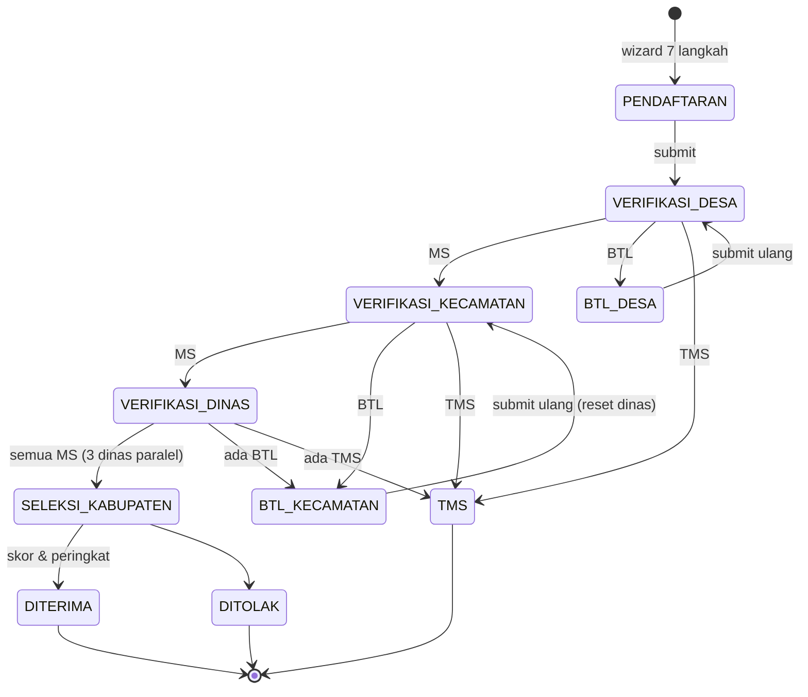
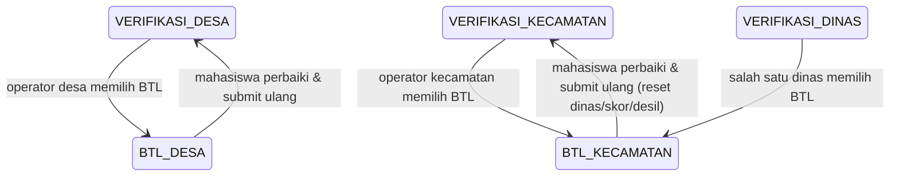

# Workflow Sistem Kartu Hebat Mahasiswa

Sistem beasiswa Kabupaten Murung Raya. Mahasiswa mendaftar, lalu pengajuan diverifikasi berjenjang desa → kecamatan → lintas dinas → seleksi kabupaten hingga hasil dipublikasikan.

## Ringkasan Alur



Diagram teks (ASCII):

```
PENDAFTARAN (wizard 7 langkah)
        │  submit
        ▼
VERIFIKASI_DESA ──MS──► VERIFIKASI_KECAMATAN ──MS──► VERIFIKASI_DINAS
      │ BTL/TMS                │ BTL/TMS                   │  (3 dinas paralel)
      ▼                        ▼                           │
BTL_DESA / TMS           BTL_KECAMATAN / TMS              semua MS
                                                            ▼
                                                  SELEKSI_KABUPATEN
                                                            │
                                                  DITERIMA / DITOLAK
                                                            │
                                                  PUBLIKASI HASIL
```

## Aktor (Role)

| Role | Tahap | Keputusan |
|---|---|---|
| `mahasiswa` | Pendaftaran | Mengisi wizard & submit |
| `operator_desa` | Verifikasi Desa | MS / BTL / TMS |
| `operator_kecamatan` | Verifikasi Kecamatan | MS / BTL / TMS |
| `operator_dukcapil` | Lintas Dinas | MS / BTL / TMS (paralel) |
| `operator_sosial` | Lintas Dinas | MS / BTL / TMS + desil sosial |
| `operator_pendidikan` | Lintas Dinas | MS / BTL / TMS + desil pendidikan |
| `operator_kabupaten` | Seleksi Kabupaten | Skoring, peringkat, DITERIMA/DITOLAK, publikasi |
| `superadmin` | Konfigurasi | Kategori, jenis dokumen, operator |

## 1. Pendaftaran

Mahasiswa mengisi **wizard 7 langkah**, tersimpan di tabel `pendaftarans`:

1. Data Pribadi
2. Pendidikan
3. Prestasi
4. Orang Tua
5. Dokumen
6. Review
7. Submit

Saat submit, `PendaftaranWorkflowBridgeService` menjembatani pendaftaran ke workflow verifikasi:

1. **Resolve wilayah** — memetakan desa/kelurahan ke master `villages` (dengan normalisasi nama wilayah).
2. **Resolve jalur** — menentukan `ApplicationType` dari kategori beasiswa: `AKADEMIK`, `TIDAK_MAMPU`, `DISABILITAS`, `NON_AKADEMIK`.
3. **Sinkronisasi** — menyalin data ke `MahasiswaProfile`, membuat/memperbarui `Application`, dan menyalin `Document`.
4. Memanggil `ApplicationWorkflowService::submit()`.

### Validasi sebelum submit

`ApplicationWorkflowService::submit()` menolak jika:

- Bukan milik mahasiswa / periode tidak aktif / status tidak bisa diedit.
- Jalur (`application_type`) belum dipilih.
- Profil belum lengkap.
- IPK kosong untuk jalur `AKADEMIK` / `NON_AKADEMIK`.
- Jalur `NON_AKADEMIK` tanpa minimal satu prestasi.
- Dokumen wajib belum lengkap (dicocokkan per jalur).

## 2. Keputusan Verifikasi (MS / BTL / TMS)

Setiap operator memberi **satu keputusan keseluruhan** (MS/BTL/TMS) atas aplikasi, **ditambah checklist per-berkas** (lihat ADR-0003): tiap dokumen dinilai `memenuhi` / `tidak_memenuhi` / `belum_dinilai` per tahap, tersimpan di `document_verifications`. Checklist adalah alat bantu + jejak audit; keputusan akhir tetap manual.

| Keputusan | Arti | Efek |
|---|---|---|
| **MS** (Memenuhi Syarat) | Lanjut tahap berikutnya | Status naik |
| **BTL** (Butuh Perbaikan) | Kembali ke mahasiswa | Status jadi `BTL_*`, pendaftaran jadi `revision` |
| **TMS** (Tidak Memenuhi Syarat) | Final, ditolak | Status jadi `TMS` |

## 3. Verifikasi Berjenjang

Inti logika ada di `ApplicationWorkflowService::verify()`, yang memilih handler berdasarkan role operator (`storeVerificationAndResolveTarget`).

### 3.1 Verifikasi Desa

- Prasyarat status: `SUBMITTED` atau `VERIFIKASI_DESA`.
- Hasil disimpan di `village_verifications`.
- Transisi: MS → `VERIFIKASI_KECAMATAN`, BTL → `BTL_DESA`, TMS → `TMS`.

### 3.2 Verifikasi Kecamatan

- Prasyarat status: `VERIFIKASI_KECAMATAN` (tidak ada status antara).
- Hasil disimpan di `district_verifications`.
- Transisi: MS → `VERIFIKASI_DINAS`, BTL → `BTL_KECAMATAN`, TMS → `TMS`.

### 3.3 Verifikasi Lintas Dinas (paralel)

- Prasyarat status: `VERIFIKASI_DINAS`.
- Tiga dinas (Dukcapil, Sosial, Pendidikan) memverifikasi **paralel**, masing-masing menyimpan di `agency_verifications` (key: `application_id` + `agency`).
- **Status application belum berubah** sampai semua dinas selesai (`return null` selama belum lengkap).
- Saat lengkap:
  - Ada TMS → `TMS`.
  - Ada BTL → `BTL_KECAMATAN`.
  - Semua MS → hitung skor (`SelectionScoringService::calculate`) → `SELEKSI_KABUPATEN`.
- Dinas juga menulis efek ke profil:
  - Dukcapil → `status_kependudukan` (`sesuai` / `perlu_perbaikan` / `tidak_sesuai`).
  - Sosial → `desil_sosial`.
  - Pendidikan → `desil_pendidikan`.

## 4. Alur BTL (Butuh Perbaikan)

BTL mengembalikan application ke mahasiswa untuk diperbaiki dan disubmit ulang.

### Dua status BTL

| Titik penolakan | Status | Label |
|---|---|---|
| Desa | `BTL_DESA` | Butuh Perbaikan dari Desa |
| Kecamatan / Dinas | `BTL_KECAMATAN` | Butuh Perbaikan dari Kecamatan/Dinas |



### Saat operator memilih BTL

1. Status application jadi `BTL_DESA` / `BTL_KECAMATAN`, `catatan` diisi alasan.
2. Observer `Application::booted()` mengubah status `pendaftaran` jadi `revision` → wizard mahasiswa terbuka kembali.
3. `locked_at` di-reset (karena `isEditableByStudent()` true untuk `DRAFT`, `BTL_DESA`, `BTL_KECAMATAN`).

### Saat mahasiswa submit ulang

Status target ditentukan dari asal BTL:

```
BTL_DESA      → VERIFIKASI_DESA
BTL_KECAMATAN → VERIFIKASI_KECAMATAN
```

Perbaikan **kembali ke tahap yang menolak**, bukan mengulang dari awal.

### Reset menyeluruh untuk BTL_KECAMATAN

Jika pernah lolos sampai lintas dinas lalu dikembalikan `BTL_KECAMATAN`, saat submit ulang sistem menghapus data downstream (lihat ADR-0002):

- `agency_verifications`, `scores`, `selection` dihapus.
- Profil di-reset: `status_kependudukan → belum_diverifikasi`, `desil_sosial` & `desil_pendidikan → null`.

Alasan: nilai lintas dinas (skor/desil) tidak valid lagi setelah data berubah.

> **Catatan**: pada alur dinas, BTL dari satu dinas kembali ke `BTL_KECAMATAN`, **bukan** `BTL_DINAS`. Jadi perbaikan melewati ulang kecamatan (kecamatan harus MS lagi) sebelum dinas re-verifikasi.

## 5. Seleksi & Skoring

`SelectionScoringService` menghitung skor per jalur memakai Strategy pattern di `app/Services/Scoring/`:

| Jalur | Strategy | Basis |
|---|---|---|
| AKADEMIK | `AcademicScoring` | IPK & semester |
| TIDAK_MAMPU | `DesilScoring` | Desil sosial ekonomi |
| DISABILITAS | `DisabilityScoring` | IPK, semester, jenis disabilitas |
| NON_AKADEMIK | `PrestasiScoring` | Tingkat & peringkat kejuaraan |

- Skor dihitung: `normalized × weight` per kriteria → `final_score` di `selections`.
- `recalculateRanking()` mengurutkan per kabupaten & jalur, mengisi `rank`.
- Operator kabupaten memutuskan `DITERIMA` / `DITOLAK`, lalu memublikasikan ke halaman `public.results`.

## 6. Pencatatan & Notifikasi

- Setiap transisi dicatat di `verification_logs` (from/to status, action, actor, notes, metadata).
- Notifikasi (`ApplicationStatusChanged`) dikirim ke mahasiswa dan operator tahap berikutnya (berdasarkan role + wilayah).

## Status Lengkap (`ApplicationStatus`)

| Status | Keterangan |
|---|---|
| `DRAFT` | Belum dikirim |
| `SUBMITTED` | Sudah dikirim (sebelum verifikasi desa) |
| `VERIFIKASI_DESA` | Antrean verifikasi desa |
| `BTL_DESA` | Butuh perbaikan dari desa |
| `VERIFIKASI_KECAMATAN` | Antrean verifikasi kecamatan |
| `BTL_KECAMATAN` | Butuh perbaikan dari kecamatan/dinas |
| `VERIFIKASI_DINAS` | Verifikasi lintas dinas (3 dinas paralel) |
| `SELEKSI_KABUPATEN` | Seleksi kabupaten (skoring & peringkat) |
| `TMS` | Final — tidak memenuhi syarat |
| `DITERIMA` | Final — diterima |
| `DITOLAK` | Final — ditolak |

## File Kunci

| File | Peran |
|---|---|
| `app/Services/ApplicationWorkflowService.php` | Mesin state utama (submit & verify) |
| `app/Services/PendaftaranWorkflowBridgeService.php` | Jembatan pendaftaran → application |
| `app/Services/SelectionScoringService.php` | Perhitungan skor & peringkat |
| `app/Services/Scoring/*` | Strategy skoring per jalur |
| `app/Enums/ApplicationStatus.php` | Status + label + progres + flag |
| `app/Enums/VerificationDecision.php` | MS / BTL / TMS |
| `app/Enums/ApplicationType.php` | Jalur seleksi + mapping strategy |
| `app/Enums/UserRole.php` | Role aktor |
| `app/Models/Application.php` | Observer sinkronisasi status pendaftaran |
